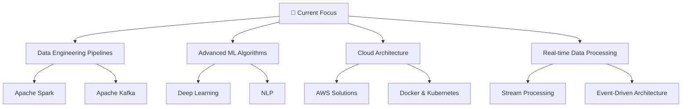

# 🌟 Welcome to My Data Universe! 🌟

```
   ____        _          _____             _                     
  |  _ \  __ _| |_ __ _  | ____|_ __   __ _(_)_ __   ___  ___ _ __ 
  | | | |/ _` | __/ _` | |  _| | '_ \ / _` | | '_ \ / _ \/ _ \ '__|
  | |_| | (_| | || (_| | | |___| | | | (_| | | | | |  __/  __/ |   
  |____/ \__,_|\__\__,_| |_____|_| |_|\__, |_|_| |_|\___|\___|_|   
                                     |___/                       
```

<div align="center">
  
</div>

---

## 🧑‍💻 About Me

> *"Data is the new oil, but insights are the refined fuel that powers innovation"*

Merhaba! I'm **Mustafa**, a passionate **Junior Data Engineer** who transforms raw data into meaningful stories. My journey began with **Philosophy** 🤔, evolved through **Psychology & Sociology** 🧠, and now I'm crafting the future with **Data Engineering** and **AI** 🚀.

```python
class MustafaGul:
    def __init__(self):
        self.name = "Mustafa GUL"
        self.role = "Junior Data Engineer"
        self.location = "🌍 Turkey"
        self.background = ["Philosophy", "Psychology", "Sociology"]
        self.current_focus = ["Data Engineering", "AI", "ML"]
        self.motto = "Bridging human understanding with data insights"
    
    def get_skills(self):
        return {
            "languages": ["Python", "SQL", "HTML"],
            "data_tools": ["Pandas", "NumPy", "Apache Spark"],
            "databases": ["PostgreSQL", "MySQL", "SQLite"],
            "cloud": ["AWS", "GCP", "Azure"],
            "ml_frameworks": ["TensorFlow", "Scikit-Learn"],
            "visualization": ["Matplotlib", "Seaborn", "Streamlit"]
        }
```

---

## 🛠️ Tech Stack & Tools

<div align="center">
  
### 💻 Programming Languages


### 🗄️ Databases & Cloud


### 🤖 AI & ML


### 📊 Data Visualization


</div>

---

## 🚀 Featured Projects

<div align="center">
  
### 🔍 **AI-Powered SQL Query Generator**
[](https://github.com/mstfgul/Retrieve-SQL-Data-via-AI)
> *Convert natural language to SQL queries using AI - because who has time to remember all that syntax?*

### 📚 **Smart PDF Chat Assistant**
[](https://github.com/mstfgul/Gemma-Q-A-with-Docs)
> *Ask questions about your PDF documents - it's like having a conversation with your research papers!*

### 🍷 **Wine Recommendation Engine**
[](https://github.com/mstfgul/WinesRecommendationProject)
> *Because life's too short for bad wine - let AI help you choose!*

### 🏠 **Real Estate Price Predictor**
[](https://github.com/mstfgul/Immo_Eliza_Deployment)
> *Predicting house prices with ML - turning data into real estate insights*

</div>

---

## 📈 GitHub Analytics

<div align="center">
  
  
</div>

<div align="center">
  
</div>

---

## 🌱 Currently Learning & Building



---

## 🎯 Philosophy Meets Data

> *"My background in Philosophy, Psychology, and Sociology gives me a unique perspective on data - I don't just process information, I understand the human stories behind the numbers."*

### 🧠 What Makes Me Different:
- **Critical Thinking**: Philosophy trained me to question assumptions and dig deeper
- **Human-Centered Approach**: Psychology helps me understand user behavior in data
- **Social Context**: Sociology gives me insights into how data affects communities
- **Ethical AI**: I believe in responsible AI that serves humanity

---

## 📊 Weekly Development Breakdown

<!--START_SECTION:waka-->
```text
Python       8 hrs 25 mins  ████████████░░░░░░░░░░░░░   65.2%
SQL          2 hrs 15 mins  ██████░░░░░░░░░░░░░░░░░░░   17.5%
Jupyter      1 hr 30 mins   ████░░░░░░░░░░░░░░░░░░░░░   11.6%
HTML         45 mins        ██░░░░░░░░░░░░░░░░░░░░░░░    5.7%
```
<!--END_SECTION:waka-->

---

## 🤝 Let's Connect & Collaborate!

<div align="center">
  
### 📫 Reach Out to Me:
  
[](https://www.linkedin.com/in/mustafa-gul00/)
[](mailto:mstfgul00@gmail.com)
[](https://github.com/mstfgul)

### 🎯 Open to Collaborate On:
- **Data Engineering Projects** 🔧
- **AI/ML Applications** 🤖
- **Social Impact Data Solutions** 🌍
- **Open Source Contributions** 💡

</div>

---

## 🎮 Fun Facts About Me

<div align="center">
  
| 🎲 Random Fact | 📊 Data Point |
|:---:|:---:|
| 🧠 Philosophy Graduate | Thinks in questions, not just answers |
| 📚 Psychology Enthusiast | Understands user behavior patterns |
| 🔍 Sociology Learner | Sees the bigger social picture |
| 🐍 Python Lover | Writes clean, readable code |
| ☕ Coffee Driven | Debug rate: 99.9% with coffee |
| 🌙 Night Owl | Best code happens after 10 PM |

</div>

---

<div align="center">
  
### 💭 *"Turning data into insights, one pipeline at a time"*

**Thanks for visiting my profile! 🚀**


[](https://github.com/mstfgul)

</div>

---

```python
# Thanks for stopping by! 🙏
if you.liked_my_profile():
    return "Let's build something amazing together! 🚀"
else:
    return "Feel free to explore my repositories! 📂"
```
